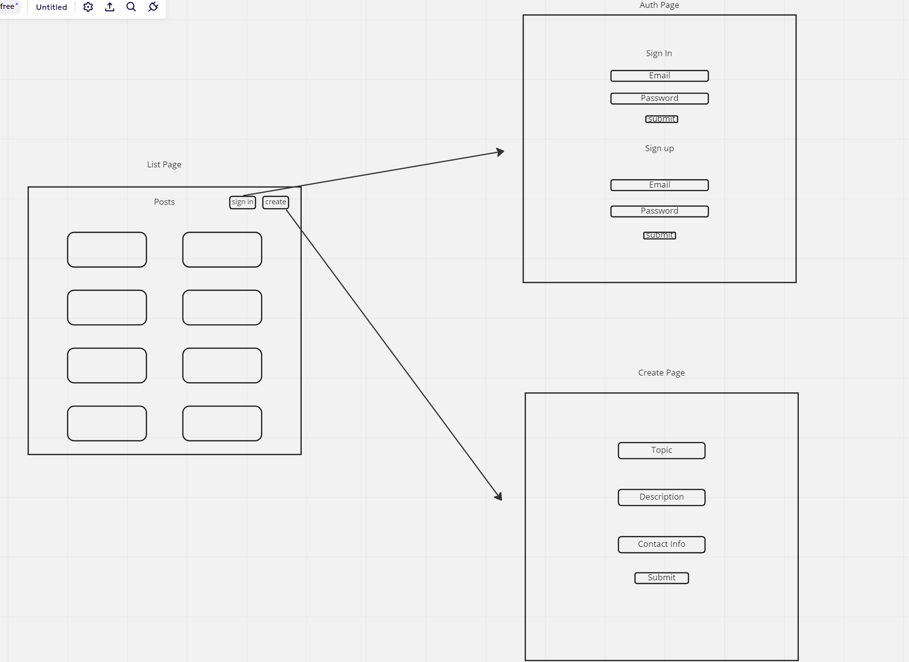

# List Page

## Data Model

    Topic: string
    Description: string
    Contact: string

## Html

    -Login Button
    -Create Button
    -Empty div

## Events

    -Load
        See if user is logged in if they are change to logout button
    -On click login
        redirects to auth
    -On click logout
        Log out user change button text to login
    -on click create
        Redirects to create

# Auth

## Html

    -Form Sign in
    -Form Sign up

## Events

    -On load
        check if user is logged in if they are redirect to list page
    -Submit Sign in
        Get email and password
        Call signIn function from fetch
        redirect to list page
    -Submit Sign up
        Get email and password
        Call signUp function form fetch
        Redirect to list page

# Create

## Html

    -Form for 'create a post'

## Events

    -Form submit
        from data creates posts and updates supabase

